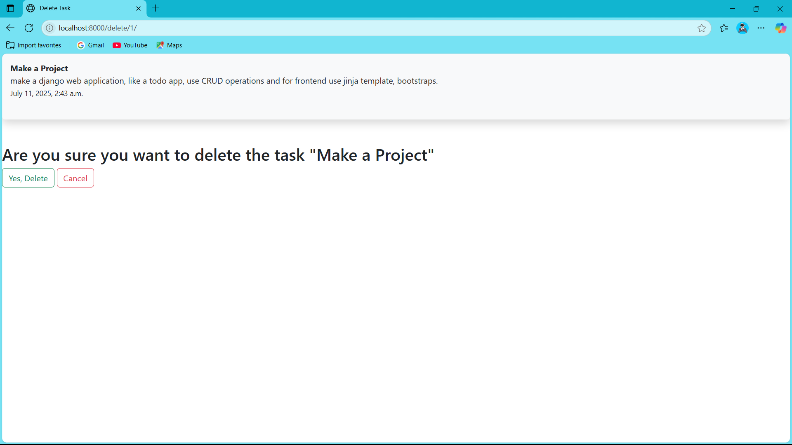

# To Do List Web Application

A simple web-based To Do List app built with Django where users can manage tasks with basic CRUD operations.

---

## 📊 Project Description

This is a minimalist To Do List application where users can:

* Add new tasks
* Edit/update existing tasks
* Delete tasks

This project is useful for beginners learning Django, Docker, and deployment workflows.

---

## 🔧 Features

* \[✅] Add Task
* \[✅] Edit Task
* \[✅] Delete Task
* \[✅] Minimal UI using Bootstrap (No JavaScript)

---

## 🧰 Tech Stack

* **Backend**: Python, Django
* **Frontend**: Bootstrap (no JS)
* **Containerization**: Docker
* **Cloud**: IBM Cloud Code Engine (Note: Could not deploy due to free tier limits)
* **Editor**: VS Code

---

## 🚀 How to Run

### 🌟 Run Locally:

```bash
# Step 1: Create and activate virtual environment
python -m venv .venv
source .venv/bin/activate  # Linux/macOS
.venv\Scripts\activate   # Windows

# Step 2: Change to project directory
cd todo  # or the main folder name

# Step 3: Run the development server
python manage.py runserver
```

Then, open your browser and go to: `http://localhost:8000`

### 🛠️ Run with Docker:

```bash
# Step 1: Build Docker image
docker build -t note-app .

# Step 2: Run the container
docker run -p 8000:8000 note-app
```

Then visit: `http://localhost:8000`

---

## 🚧 Docker Image

* **Image Name**: `note-app`
* **IBM Cloud Registry**: `de.icr.io/mayankgupta024/note-app:1.0`

> IBM Cloud Code Engine was planned for deployment, but it requires a paid account.

---

## 🖊️ Screenshots

### 📝 Empty Task List


### ✅ Task List with Items


### ➕ Add a New Task


### ✏️ Update Task


### ❌ Delete Task



---

## 👤 Author

**Mayank Gupta**

---

## 🌍 License

This project is licensed under the MIT License.

---

Feel free to clone, modify, and contribute!
